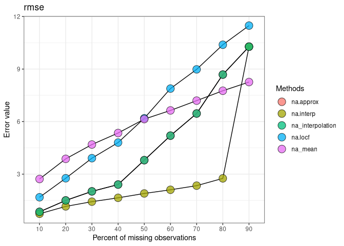

<!-- README.md is generated from README.Rmd. Please edit that file -->

# imputeTestbenchG

<!-- badges: start -->

[](https://CRAN.R-project.org/package=imputeTestbenchG)
[](https://lifecycle.r-lib.org/articles/stages.html#experimental)
<!-- badges: end -->

## Installation

``` r
# install.packages("devtools")
devtools::install_github("Mayur1009/imputeTestbenchG")
```

#### Load the package:

``` r
library(imputeTestbench)
```

#### Basic use

``` r
a <- impute_errors(data = nottem)
a
#> $Parameter
#> [1] "rmse"
#> 
#> $MissingPercent
#> [1] 10 20 30 40 50 60 70 80 90
#> 
#> $na.approx
#> [1] 0.9162661 1.3805052 2.0013405 2.7664492 3.6789635 5.2671039 6.5445688
#> [8] 8.3739624 9.9329219
#> 
#> $na.interp
#> [1] 0.7910136 1.0955786 1.3470162 1.5978807 1.9130360 2.0751923 2.3537695
#> [8] 2.6036849 9.9329219
#> 
#> $na_interpolation
#> [1] 0.9162661 1.3805052 2.0013405 2.7664492 3.6789635 5.2671039 6.5445688
#> [8] 8.3739624 9.9329219
#> 
#> $na.locf
#> [1]  1.732403  2.721411  3.913568  5.184689  6.440889  7.744291  9.561945
#> [8] 10.458099 11.299014
#> 
#> $na_mean
#> [1] 2.587900 3.802117 4.663188 5.333619 6.070594 6.653130 7.230423 7.648520
#> [9] 8.232330
plot_errors(a, plotType = 'line')
```


